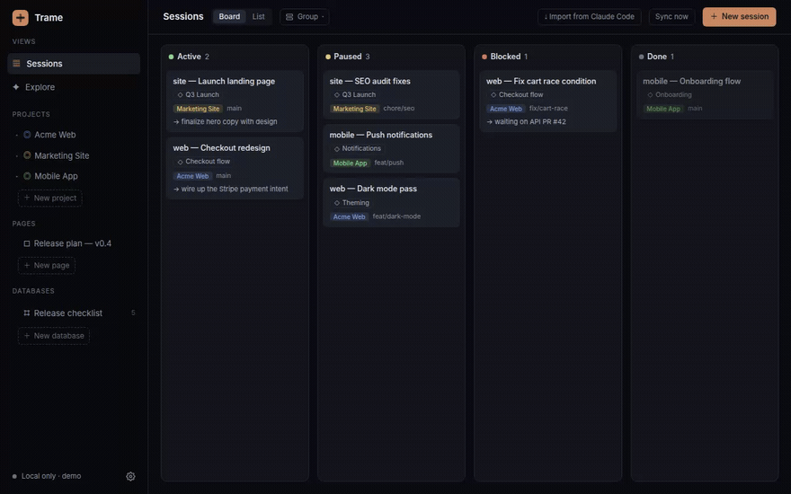
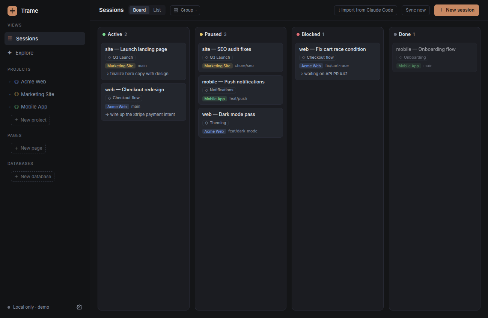
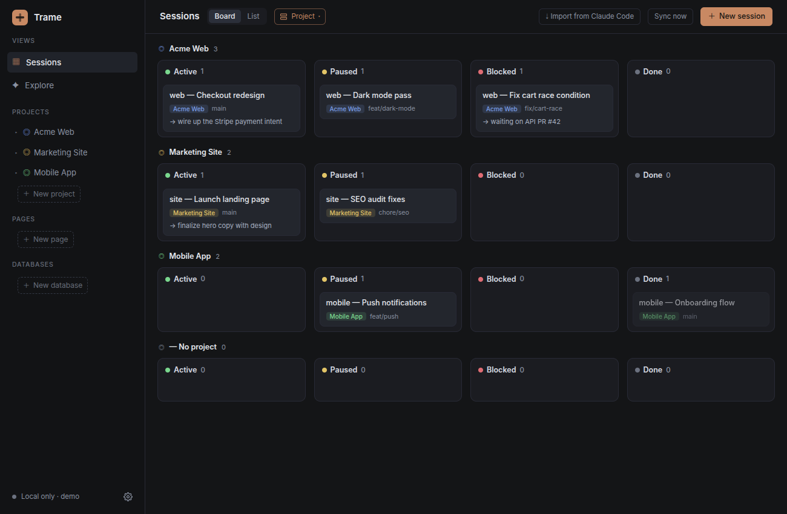
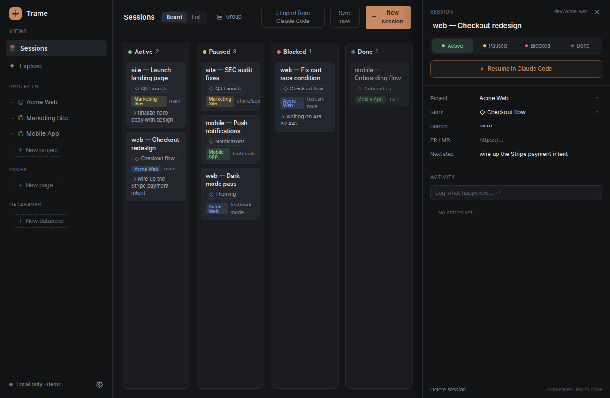
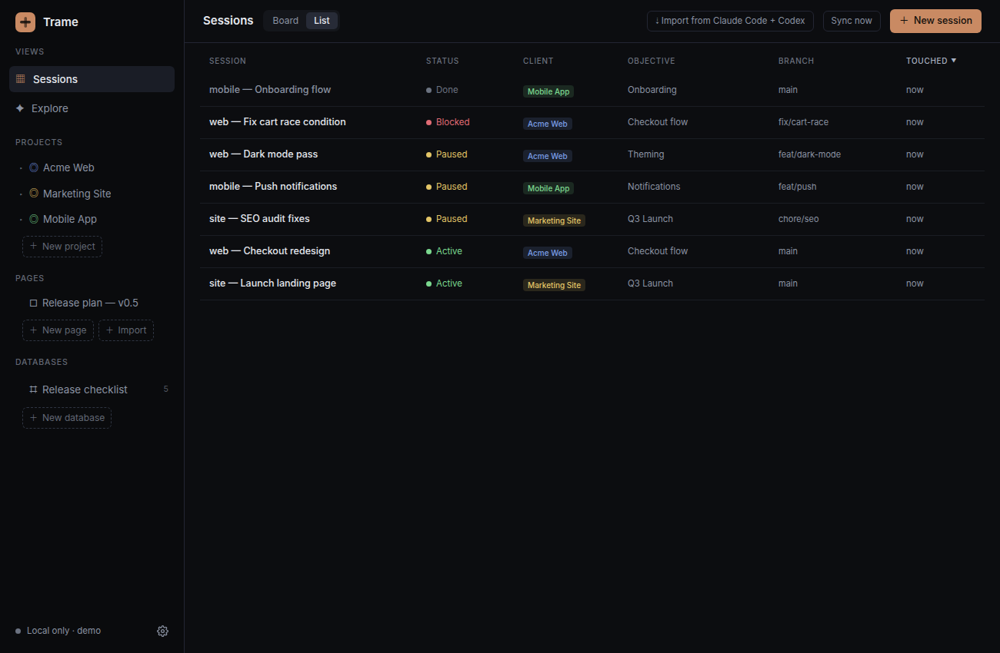
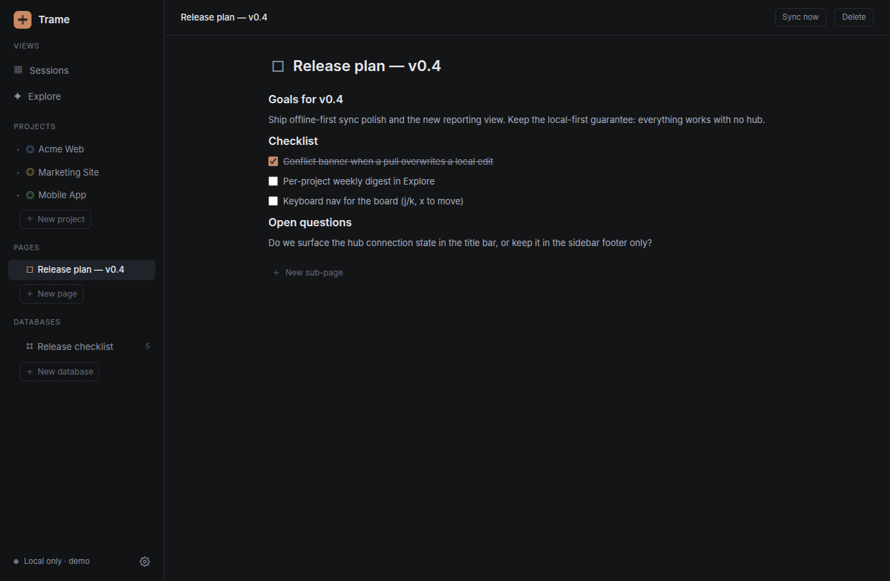
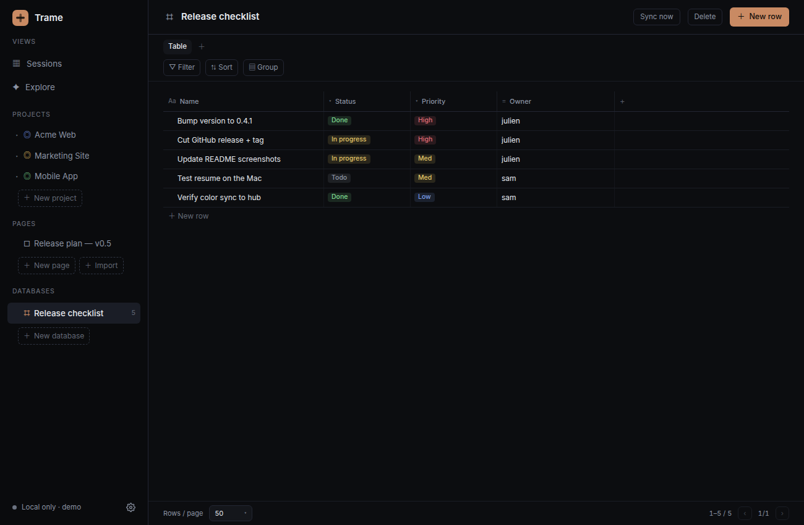
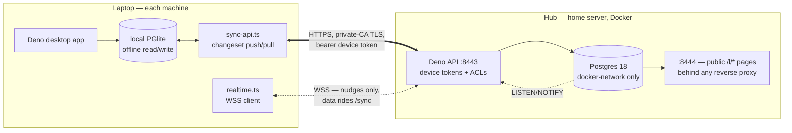

# trame

A **local-first** Claude Code and Codex session tracker. Each session ladders up to a **story** (grouped
under a **project**); the board is **status columns × swimlanes** — the view no off-the-shelf
tool gave us, and the columns are **yours to define**. It also holds free-form **pages** — inline
comments (with agent reply threads), **sandboxed interactive HTML blocks**, per-page guest sharing,
**public read-only share links** — and **Notion-style databases** (sortable / filterable / groupable views).
`⌘P` jumps to any session, page, or database; a card's **Resume** button reopens the session in Claude
Code or Codex. Opt-in **plugins** add side panels — the first one lists GitHub/GitLab
**deployments waiting for approval**.

Stack: **Deno-desktop** app → **local PGlite** (embedded Postgres, offline read+write) →
custom **changeset LWW sync over HTTPS** → a small **Deno API in front of Postgres** on a home
server (the hub), with **WebSocket nudges** so edits propagate between machines in seconds.
No PowerSync, no Electric. Everything is Postgres, so the SQL is identical on the laptop and
the hub. (Design + migration story: `docs-site/src/content/docs/hub-api.md`.)

```
 laptop A (Deno app)                          laptop B (Deno app)
   ├─ local PGlite  ◀── read/write offline ──▶  local PGlite
   └─ sync ─┐  POST /sync (mutations ⇅ changes)  ┌─ sync
            ├──────────▶  Deno API @ hub  ◀──────┤   (auth boundary; Docker, home LAN)
            └── WSS ◀──  "changed, pull now"  ──▶┘        └─▶ Postgres (source of truth)
 /trame:track ─▶ local app if running, else local outbox.jsonl (app drains on launch)
```

## Demo



> A short tour: filter the board by story, regroup into swimlanes, open a session and
> **resume it in Claude Code or Codex**, sort the list, then browse a page and a database.
> ([higher-quality MP4](docs/demo.mp4) · screens use demo data, recorded pre-0.4)

| Kanban board — status columns | Swimlanes — group by project or story |
| :--- | :--- |
| [](docs/board.png) | [](docs/board-grouped.png) |
| **Session drawer — resume in Claude Code / Codex** | **Sortable list view** |
| [](docs/drawer.png) | [](docs/list.png) |
| **Pages — notes & docs next to the work** | **Databases — Notion-style tables** |
| [](docs/page.png) | [](docs/database.png) |

## Requirements
- **Deno 2.9+** on each laptop (for `deno desktop`). Install: `curl -fsSL https://deno.land/install.sh | sh`.
- **Docker + openssl** on the hub machine (certs are generated there; the CA key never leaves it).
- Laptops reach the hub's API over the **home LAN** (no Tailscale required;
  the hub binds to its LAN IP — install Tailscale there if you want sync away from home).
- Node/npm is pulled in only to build the Vite frontend (via `deno task web:build`).

## Layout
```
db/schema.sql              shared schema (hub Postgres AND local PGlite) — idempotent; re-applying it IS the migration
docs-site/                 Astro + Starlight docs (data model, hub API design, release notes) — `just docs`
protocol/                  versioned sync protocol shared by app and hub (entities, LWW rule, html-block bridge)
hub/docker-compose.yml     the hub: Postgres (docker-network only) + the Deno API in front of it
hub/api/                   the API: device tokens, changeset /sync, per-page ACLs, WSS nudges, public /l/* pages
hub/deploy.sh              deploy the hub over ssh (~/Apps/tracker) — `just db-deploy`
hub/gen-certs.sh           private CA + server certs, runs on the hub (called by deploy)
hub/issue-cert.sh          fetch the hub's ca.crt so this laptop trusts the API's TLS — `just db-cert`
hub/pg_hba.conf            Postgres auth rules: local + docker network only, anything else rejected
app/                       Deno-desktop app
  main.ts                  window + in-process HTTP (serves UI + /api), startup sync loop
  db.ts                    local PGlite + queries + outbox drain
  sync-api.ts              changeset push/pull against the hub API (cursor in sync_state)
  realtime.ts              WSS client — hub nudges turn into a pull within seconds
  identity.ts              users/devices — which user this laptop writes as
  config.ts                env config (NODE_ID, data dir…)
  share.ts                 export/import a page subtree as a portable *.trame.json bundle
  csrf.ts                  same-origin guard for /api (it spawns terminals, opens files…)
  plugins/                 opt-in in-tree plugins (deployments: GitHub/GitLab approvals)
  settings-store.ts        single writer for the device-local settings JSON (0600, holds tokens)
  agent-comments.ts        canonical Codex/Claude identities (branded SVG avatars) + block resolution
  presence.ts              ephemeral "who's here" registry (viewers + active watchers; not synced)
  web/                     React swimlane board (Vite)
mcp/server.ts              Trame MCP server (stdio): board, pages, comments, html blocks, reports, sync
track/cli.ts               tramecli — the compiled agent CLI (writers + list/answer/setup/mcp)
track/help.ts              the agent contract strings: CLI --help, MCP capabilities, stub stamping
track/track.ts             the /trame:track session writer (app or outbox)
track/page.ts              the $trame-page writer (Markdown → atomic page create)
track/comment.ts           agent page comments (title/quote resolution + attribution)
track/watch.ts             the comment watcher — agents auto-answer human replies (`tramecli answer`)
track/claude-hook.ts       UserPromptSubmit hook: records cwd → Claude session id for track.ts
bin/quickstart.sh          curl-able laptop setup: clone + packaged app + agent integrations
commands/trame/track.md    the /trame:track slash command — embedded in tramecli, installed by `tramecli setup`
skills/trame-{track,page}/ agent skills (Codex & friends) — embedded in tramecli, installed by `tramecli setup`
```

## Setup

### Quickstart (laptop)
```bash
curl -fsSL https://raw.githubusercontent.com/Andarius/trame/master/bin/quickstart.sh | bash
```
Clones to `~/trame` (override with `TRAME_DIR`), installs Deno if missing, installs the
latest packaged app for the platform (snap or AppImage on Linux x64, dmg on Apple
Silicon; `TRAME_APP=source` builds from the checkout instead, `TRAME_VERSION=v0.9.0`
pins a release), and wires Claude Code and Codex (`TRAME_TARGETS=claude` or `codex`
to pick one, `none` to skip; any other agent CLI that reads an Agent Skills directory
→ `TRAME_SKILL_DIRS=~/.gemini/skills`). The hub (step 1), device token (step 2), and
Claude session hook (step 4) still need the manual steps below.

### 1. The hub
```bash
just db-deploy       # ssh: copies compose+schema+hba+api to ~/Apps/tracker, creates .env+certs, starts it
just db-cert         # per laptop: fetch ca.crt (trusts the API's TLS)
```
First run generates the password and the CA/server certs, and binds to the hub's LAN IP
(never 0.0.0.0). Postgres itself has **no host port** — laptops talk to the Deno API on
`:8443`, which terminates TLS with the same private-CA cert. Idempotent — rerun to redeploy
(re-applies the schema and restarts the API).

### 2. Each laptop
Mint a device token on the hub (`<node-id>` = the laptop's `TRACKER_NODE_ID`), then point the app at the API:
```bash
# e.g. for the laptop whose TRACKER_NODE_ID is "mbp-14"
ssh <hub> "docker exec tracker-api deno run -A --config /srv/hub/api/deno.json /srv/hub/api/main.ts mint mbp-14"
# → prints the token ONCE (only its sha-256 is stored); re-run mint for a fresh one, revoke old rows in api_tokens
```
Paste the URL + token in ⚙ Settings → Sync hub, or add to `~/.local/share/trame/settings.json` (chmod 600):
```json
{ "hubApi": "https://192.168.1.x:8443", "hubApiToken": "<minted token>" }
```
Env (shell profile, or the project `.env` for `just`):
```bash
export TRACKER_NODE_ID="mbp-14"                                   # unique per machine
# folders scanned (depth 4) for *.html reports + *.excalidraw drawings, shown+searchable in Explore
export TRACKER_REPORT_PATHS="$HOME/Projects:$HOME/code"
# optional: client names detected from a repo path (/<Client>/); anything else → "Side-projects"
export TRACKER_CLIENTS="Acme,Globex"
```
### 3. Run the app
```bash
cd app
deno task web:build     # build the React frontend → web/dist
deno task dev           # opens the desktop window (Deno 2.9+)
# no desktop subcommand yet? →  deno task serve   then open http://localhost:8787
# frontend dev with HMR:        deno task web:dev  (proxies /api to :8787)
```

### 4. Wire session tracking

Agents talk to Trame through **`tramecli`**, one compiled binary that wraps the
writers (`track`, `page`, `comment`, `watch`, `list`) — its `--help` carries the
full agent contract, including the field-composition conventions:

```bash
tramecli --help          # commands overview
tramecli track --help    # the writer contract agents compose against
tramecli list            # open sessions grouped by story (--json for jq)
```

It ships in the snap (aliased to `tramecli` by `bin/snap-install-release.sh`) and as
a per-platform release asset. With the binary on PATH, install the agent docs from
it — no checkout or deno needed:

```bash
tramecli setup                   # interactive target picker
tramecli setup --claude --codex  # non-interactive; also --skills-dir ~/.gemini/skills
```

From a dev checkout, `just setup` compiles a fresh binary and runs its setup —
flags pass through, and any agent CLI that reads an Agent Skills directory works:
```bash
just setup --claude --codex --skills-dir ~/.gemini/skills
```

In Codex, use `$trame-track`, `$trame-track paused "note"`, or `$trame-track list`
for sessions, and `$trame-page` to create or comment on standalone Trame pages.
Codex exposes `CODEX_THREAD_ID`, so the session writer automatically links the card
to the current resumable session; no hook is needed.

In Claude Code, `/trame:track` records the current session as a card on the board — it
reads the repo, branch, and a one-line note from the conversation and writes straight to
your local PGlite (syncing to the hub when online, else queued in the outbox). From any
repo: `/trame:track` to log the session, or `/trame:track paused|blocked|done "note"` to
set its status with a note. Setup also installs the `trame-page` skill into
`~/.claude/skills/` — picked up automatically when you ask to save a document, note, or
plan as a Trame page. (Setup stamps the docs with the binary's invocation — don't copy
the files by hand.)

For the card's **Resume** button to work, the writer needs the Claude session UUID — slash
commands can't see their own session id, so a `UserPromptSubmit` hook records it per-cwd into
`~/.local/share/trame/claude-sessions.json`. Register it in `~/.claude/settings.json`
(per machine):
```json
"hooks": {
  "UserPromptSubmit": [{ "matcher": "", "hooks": [{
    "type": "command",
    "command": "deno run -A /path/to/trame/track/claude-hook.ts",
    "timeout": 5
  }] }]
}
```
Without the hook `/trame:track` still works — the card just has no transcript link. Cards
imported from the app's Claude Code + Codex dialog carry the UUID as their id and never need it.

### 5. Page comments & the agent watcher

Any page block can hold a thread of inline comments. Agents leave review comments with the
`trame_add_comment` MCP tool or `tramecli comment` (identify the page by title, the
block by a unique text quote). `agent` is the id of the model actually writing — **Codex**
and **Claude** get a branded avatar, any other model id (`glm`, `gemini`, …) gets a generated
one — so the author is honest, not forced to a harness seat. Agent comments stay out of your
own author identity.

```bash
# an agent leaving a comment (JSON as arg or on stdin)
echo '{"page_title":"Release plan","block_text":"Ship the first release",
       "body":"Clarify the rollback criterion.","agent":"codex"}' | tramecli comment
```

Reply to an agent's comment in the UI and the **watcher** closes the loop: it marks your
reply *seen*, shows *"Claude is answering…"*, runs the thread's agent to compose an answer,
and posts it — with a `model · tokens · seconds` footer. Run it in its own terminal:

```bash
tramecli answer                     # answer any thread whose agent it can run
tramecli answer --cwd ~/Projects/some-repo  # let the agent read that repo when answering (read-only)
tramecli answer --agents claude     # only handle Claude threads
tramecli answer --once --dry-run    # one pass, print prompts without answering
```

The CLI runs read-only, but the thread text is attacker-controllable on a shared page and is
fed to a tool-capable agent: don't point `--cwd` at a repo holding secrets on shared/multi-user
pages — a crafted reply could coax the agent into leaking file contents into its answer.

It finds the running app via the port file, polls every 5s, processes one reply at a time,
and survives app restarts (backs off) and its own crashes (a stuck *answering…* self-heals).
Failures retry twice then park as *no answer* until you edit the reply — never a loop. The
agent CLIs must be installed and authenticated in that shell; each answer spends real tokens.
`codex` and `claude` are built in; **any other model** (`glm`, `gemini`, …) is answerable by
giving it a runner via `TRAME_WATCH_<AGENT>_CMD` — e.g. `TRAME_WATCH_GLM_CMD="glm -p {}"`
(the `{}` placeholder is replaced by the prompt; no `{}` → prompt on stdin). The same env var
overrides the built-ins, e.g. `TRAME_WATCH_CLAUDE_CMD="claude -p {} --output-format json --model haiku"`.

The top of each page shows a **presence** stack (Notion-style avatars): you while the page is
open, plus every agent a running `tramecli answer` is covering (copper ring). It's device-local and
ephemeral — never synced — so avatars fade ~20s after a tab closes or the watcher stops.

### 6. Plugins (optional)

⚙ Settings → **Manage plugins**. Everything ships disabled — a networked plugin never reaches
out until you switch it on.

**Deployments** lists GitHub/GitLab releases **waiting for approval** in the sidebar (plus
in-progress and recently-failed ones), and approves the gate / plays the manual job from the
panel. Point it at the repos and projects to watch, then authenticate per forge with a PAT,
`GITHUB_TOKEN` / `GITLAB_TOKEN`, or the `gh` / `glab` CLI (optional — there's a login button
that spawns a terminal).

> Tokens live only in this machine's `settings.json` (mode 0600). They are never synced to the
> hub and never sent back to the UI, and each is bound to the forge host you configured.

## How sync works
- **Transport**: HTTPS to the Deno API on `:8443` (TLS terminated by the API with the hub's
  private-CA cert — `just db-cert` fetches the CA once per laptop). Every request carries a
  **per-device bearer token**, minted on the hub and stored sha-256 at rest, revocable.
  Postgres itself has no host port — the API is the only way in.
- **Changesets**: `POST /sync` sends local mutations since a cursor and returns
  `{acknowledgements, rejectedMutations, changes, nextCursor}`. The cursor is a
  **server-issued monotonic revision** (`change_log.rev`) — client clocks never order
  delivery. A bad mutation is rejected alone; the rest of the batch lands.
- **LWW merge**: every row has `updated_at` (value clock), `origin` (writing node), and
  `deleted` (soft delete). Hub and laptop apply the same rule from the shared `protocol/`
  package: `on conflict … do update … where excluded.updated_at >` the stored row's.
- **Authorization**: the hub checks every mutation against the caller's access — members see
  the whole workspace, guests only shared subtrees (grants back-fill history, revocations
  send tombstones). Comment authorship is pinned server-side.
- **Realtime**: triggers append to `change_log` and `pg_notify`; the API debounces and nudges
  connected laptops over WSS ("changed, pull now"), and local writes debounce a push — edits
  propagate device-to-device in a couple of seconds. The 15s poll stays as fallback.



## Packaging & releases

Push a `v*` tag (matching `app/deno.json` `version`) and GitHub Actions builds the desktop
apps and attaches them to the [release](https://github.com/Andarius/trame/releases):

| Platform | Assets | First launch |
| :--- | :--- | :--- |
| **Linux** | `Trame.AppImage`, `trame.deb`, `.snap` (classic), `tramecli-<tag>-linux-x64` | snap: `bin/snap-install-release.sh` → `snap install --dangerous --classic` (aliases `trame.tramecli` → `tramecli`) |
| **macOS** | `Trame.dmg` (Apple Silicon), `tramecli-<tag>-macos-arm64` | ad-hoc signed — right-click → **Open**, or `xattr -dr com.apple.quarantine /Applications/Trame.app` |

> Proper macOS signing/notarization needs an Apple Developer identity in
> `desktop.macos.codesignIdentity`.

Assets (`web/dist`, `db/schema.sql`) are **embedded into the binary** via raw imports
(`scripts/gen-embed.ts`, regenerated by `just web-build`) — bundles run from anywhere with no
disk layout. Local builds: `just bundle` (AppImage), `deno task bundle:mac` (on a Mac).
