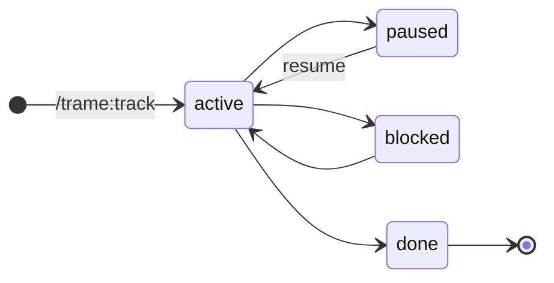

import DataModelTree from '../../components/DataModelTree.astro';

## A session

One card per `repo × branch`: a tracked stretch of coding-agent work, logged from the conversation (`/trame:track`, `$trame-track`, MCP `trame_track`) and resumable later. Tracking the same repo + branch again **updates** the card instead of duplicating it. Its status is the board column:

| Field | Role |
| :--- | :--- |
| `repo_path` + `branch` | Identity — the upsert key among open sessions. |
| `next_step` | One imperative line to pick the work back up. |
| `summary`, `pr_url` | What happened, where it landed. |
| `agent`, `claude_id` | Which agent, and the link back to its transcript. |
| `page_id` | Where it sits in the tree (next section). |

## One tree, everything attached

Everything lives in a single `pages` table; sessions, comments, reports and user databases
(`udb_databases` and their `udb_rows`) all anchor to it. Step through:

<DataModelTree />

Comments anchor to a specific block inside `pages.content`.

- Filtering or grouping by a story is **subtree-based**: it catches sessions anchored anywhere under it.
- No `◇` ancestor (anchored to a project, or a page right under one) → story-less session.
- Views show the anchor only as the tail of `Project › Story › page`.

The top level is an inbox, not a home. The sidebar splits root entries into **Projects**,
**Shared with me** (roots owned by another hub user — shares and sync can't guess where
they belong in *your* tree), and **Unfiled** (parentless plain pages awaiting triage).
Agents are nudged to nest new pages under the relevant project instead of the root.

One denormalized remnant: `sessions.client_id` holds a Project page id, used only as the
fallback when a session has no anchor.
