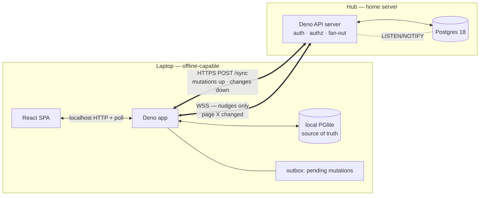

# Hub API server — design

Status: **phases 1–7 shipped** (identity, change_log, API `/sync`, coexistence capture, WS nudges, direct-PG cutover, per-page ACLs) — only page-content CRDT (step 8) remains ·
Supersedes: laptops talking directly to hub Postgres over mTLS ·
Second opinions: Codex, Gemini, Vibe (all concur — see [Appendix](#appendix-second-opinions))

## Why

Trame is local-first and **single-user today**: each laptop runs a Deno app over an embedded
Postgres (PGlite) and syncs to a hub via a custom last-write-wins (LWW) push/pull that connects
**directly to the hub's Postgres over mutual TLS**. The hub is *just a Postgres container* — no
application server (`hub/docker-compose.yml`, `app/sync.ts`).

We want **multi-user live collaboration**: inline page comments shared between people (the
`page_comments` table already exists and already rides the sync), realtime push instead of the
15 s poll, and later **selective per-page sharing** with access control.

Every one of those lives on the server side of a line the current design doesn't have:

- **Authz** (selective sharing) — you can't enforce "you see only what's shared with you" when
  every laptop holds raw SQL access to the whole database. Postgres RLS *could* do it but is
  brittle, leaks details, and would make the sync protocol depend on subtle session state.
- **Realtime** — websockets/presence need a process that holds connections; Postgres isn't that.
  `LISTEN/NOTIFY` is one persistent DB connection *per listener* and scales poorly.
- **Identity & onboarding** — today a new person needs a client cert + the raw DB password +
  LAN/Tailscale. Accounts + tokens replace that.

**Decision: put a Deno/TS API server on the hub in front of Postgres.** Laptops sync through it;
it is the auth/authz boundary and the realtime fan-out. The mTLS-direct-to-PG model was a
transport hack for a single user; the API is the correct abstraction.

`LISTEN/NOTIFY` doesn't disappear — it stays useful **between Postgres and the API**, just not
between Postgres and laptops.

## Decisions (locked)

| Area | Decision |
| :--- | :--- |
| Hub | Deno/TS **API server** in front of Postgres (not raw PG access) |
| Language | **Deno/TypeScript** — share `db/schema.sql`, row types, and the LWW module between client and hub |
| Sync | **Changeset-based** `POST /sync` (mutations up, changes down) — see [Sync protocol](#sync-protocol) |
| Pull cursor | **Server-issued opaque monotonic revision**, *not* client `updated_at` (client clocks are unsafe with multiple writers) |
| Offline | Local PGlite stays the source of truth; writes hit a **durable outbox in the same transaction**; the app works fully offline |
| Realtime | **WSS** carrying nudges only (data path stays HTTP `/sync`) — see [Realtime](#realtime-wss) |
| First feature | **Comments** — append-only, no LWW-clobber risk, highest value, exercises the whole gateway |
| Fallback | The existing periodic poll stays as the belt-and-suspenders path when the socket is down |

Non-negotiable: **never bundle transport migration + auth + ACLs + realtime + conflict-model into
one release.** Each is its own phase.

## Stack

Hand-rolled, not an off-the-shelf sync engine: Electric/PowerSync/Zero/Triplit each impose their
own conflict model or full-sync-over-the-wire, which fights the HTTP-data + WSS-nudge design and our
LWW. That also matches the repo's stated stance ("No PowerSync, no Electric"). Postgres logical
replication isn't a client-sync tool (no offline, no conflict resolution).

| Concern | Use | Note |
| :--- | :--- | :--- |
| HTTP routing + middleware | **Hono** | Auth/logging/error chain in front of `/sync` + the WS upgrade; `Deno.serve(app.fetch)` |
| WebSocket | **`Deno.upgradeWebSocket`** | Built-in; re-check the token at the handshake (not deprecated `std/ws`) |
| Postgres driver | **postgres.js** | Already used in `app/sync.ts` — reuse (not `@neondatabase/serverless`) |
| Payload validation | **zod** | Mutation/response schemas in the shared, versioned `sync/protocol` package |
| Auth | **opaque revocable session tokens** (argon2id passwords) | App-level authz; Postgres RLS only as defense-in-depth — not JWT+RLS |
| Change tracking | server `change_log` + monotonic revision cursor | Ordering authority; not client `updated_at` |
| TLS / deploy | **Deno terminates TLS + WSS itself** (`Deno.serve({cert,key})`, reuse `gen-certs.sh`) | **No reverse proxy** on the LAN hub until it earns its place — cert rotation without app restarts, a shared `:443` for multiple services, or HTTP/3. Then **Caddy** (`tls internal` or the existing certs). nginx/HAProxy/Traefik don't fit a fixed single-service LAN hub. |

Second opinion (Vibe) independently reached the same build-vs-buy call and the same core stack.
A reverse proxy is deferred: the hub is a private-CA LAN box (no public DNS / port 80), so
auto-Let's-Encrypt — every proxy's headline feature — doesn't apply, and one Deno service can
terminate TLS+WSS on its own.

## Topology



Two hops, deliberately different:

- **App ↔ hub API** (cross-machine): the hop that must become live. Changeset `/sync` over HTTPS +
  a WSS nudge channel.
- **Browser ↔ local app** (same machine): stays the existing poll (or a local push later). Never
  the bottleneck.

## Sync protocol

Local reads/writes never block on the network. Every mutation is written to PGlite **and**
appended to a durable outbox in the *same* transaction, so a crash can't lose or double-apply it.

```text
POST /sync
{
  cursor,                       // opaque, server-issued; null on first sync
  mutations: [
    { mutationId, entity, id, op: "upsert" | "delete", value }
  ]
}

→ 200 {
  acknowledgements: [ mutationId ],      // applied — drop from the outbox
  rejectedMutations: [                   // surfaced, never silently dropped
    { mutationId, reason }               // e.g. "forbidden", "stale", "schema"
  ],
  changes: [
    { revision, entity, id, value | tombstone }
  ],
  nextCursor
}
```

Properties:

- **Idempotent pushes** — `mutationId` is stable; retrying a partially-applied batch is safe.
- **Per-mutation authz** — the server validates auth + page access on each mutation and can reject
  individual ones without stalling the queue (a batch of 10 with 2 forbidden acks 8, rejects 2).
- **Server revision, not client clock** — pulls resume from an opaque monotonic `cursor` the
  server issues from a change-log. Client `updated_at` and strict timestamp watermarks are unsafe
  once there are multiple writers; keep the LWW *envelope* (`origin`/`updated_at`/`deleted`) as the
  first protocol version, but the *ordering authority* is the server log.
- **Merge rule — two authorities** (resolves the old open question): server `rev` is the
  *delivery-ordering* authority; the LWW envelope `updated_at` is the *value-resolution* authority.
  On push the server assigns `rev`, checks authz, and applies the *same*
  `on conflict … where excluded.updated_at > …` rule the client uses today — sourced from the shared
  package. So an offline client with a genuinely newer `updated_at` still wins on value, but no
  client clock ever decides delivery order.
- **Rejected mutations are UI state** — the app shows "couldn't sync (forbidden/stale)", it does
  not discard the edit silently.

The realtime channel never carries data — it only says "there are changes ≥ revision N"; the client
then does a normal durable `/sync`.

## Change-log & cursor

The server's `change_log` is one mechanism doing three jobs the sections above list separately — the
monotonic cursor, coexistence capture, and the WS-nudge source:

```sql
create table change_log (
  rev    bigint generated always as identity primary key,  -- monotonic, server-issued cursor
  entity text not null,        -- 'sessions', 'page_comments', …
  row_id uuid not null,
  op     text not null,        -- upsert | delete
  at     timestamptz not null default now(),
  actor  uuid,                 -- users.id; null during legacy coexistence
  source text                  -- 'api' | 'legacy-direct'
);
```

- **One `after insert/update/delete` trigger per synced table** appends a row *in the same
  transaction* as the mutation (atomic), then `pg_notify('changes', '')`.
- **Pull** = `where rev > $cursor order by rev limit $batch`, hydrate each `row_id` to its current
  state (coalesce repeats in a batch to the latest), tombstones for deletes, `nextCursor` = max
  `rev` served.
- **Coexistence capture** falls out for free: a legacy client writing over mTLS fires the same
  trigger, so the log stays complete through cutover.
- **Fan-out**: the API holds one `LISTEN changes`; on NOTIFY it pushes `{changed, minRevision}` to
  subscribed WS clients.
- **Compaction**: `where at < now() - interval '30 days'` is safe — poll + cursor self-heal; a
  device offline >30 d re-syncs from scratch.

## Realtime (WSS)

WSS chosen over SSE (explicit call): a general duplex foundation for later presence/typing/cursors,
so we don't swap transports when those land. It carries **invalidation nudges only**.

```text
S→C  { type: "changed", minRevision }     // "pull to catch up"
C→S  { type: "hello", cursor }            // sent on (re)open — server streams missed nudges
      ping / pong                          // heartbeat
```

Because WSS bypasses the HTTP middleware chain, we own four things:

1. **Auth at the handshake** — re-check the token at `upgradeWebSocket`, reject *before* completing
   the upgrade. The one place not to let the boundary leak.
2. **Reconnect + backoff** — client-side (no free `EventSource` reconnect). Exponential + jitter.
3. **Catch-up on (re)open** — client sends its last `cursor`; server streams missed nudges, then
   goes live. A dropped socket loses no data — the next `/sync` reconciles regardless.
4. **Heartbeat** — ping/pong to detect half-open connections and defeat idle timeouts.

Nudge-only means correctness never depends on the socket; it only depends on `/sync`. The 15 s poll
stays as the fallback when the socket is down.

## Identity & auth

- **Accounts + tokens** replace per-laptop client certs for app-level auth. A device is still a
  device (`origin`/`NODE_ID` stays for LWW), but a **user** is a first-class account.
- **Author identity is a prerequisite for shared comments.** `page_comments` records only `origin`
  (the node), not a person — on a shared board every note would be anonymous. Add an `author`
  (user id) column + a display name, stamped on write. This is the first concrete schema change.

## Access control (later phase)

Selective per-page sharing is a filter on `/sync` (pull returns only rows the caller may see; push
validates page membership). Two realities to design around:

- **You cannot make an offline laptop forget** a page it already pulled — revocation is
  tombstones-on-reconnect (purge/mask locally), not DRM.
- **During coexistence**, capture changes with DB triggers so the change-log stays complete whether
  a write came from a legacy direct-SQL client or the API.

## Conflict semantics — the actual hard part

The risk is **not** the websocket. `pages.content` is **whole-document JSONB LWW**, designed for a
single user: two people editing the same page body will lose each other's work. Comment rows are
**append-only**, which is exactly why comments-first is safe. Live *page* co-editing eventually
needs block-level operations or a CRDT — and that is its **own** phase, never mixed with a transport
or auth change.

## Language & code sharing

Deno/TS end-to-end lets the hub import the same `schema.sql`, row codecs, LWW rules, and domain
types the client already uses — less semantic drift, one toolchain. But **extract a small versioned
`sync/protocol` package with runtime validation**; do not import the laptop app wholesale into the
server. Go is defensible only for a large, heavily-loaded service (premature); Python offers the
least reuse here.

## Migration plan

Incremental, feature-flagged, no big bang. The existing poll runs underneath the whole time.

1. **Identity & schema** — accounts/devices, workspace ownership, `page_comments.author`, explicit
   page-permission semantics. No transport change yet.
2. **Durable outbox + server change-log/revision** — add locally and on the hub while still on the
   15 s poll.
3. **API beside Postgres** — Deno API implementing *today's* full-row LWW behind a client feature
   flag (`syncViaAPI`, default off). Behaviour-identical; test with one user.
4. **Coexistence capture** — DB triggers record changes from both legacy clients and the API so the
   log is complete during the transition.
5. **WSS nudges** — add the socket; retain poll/reconnect catch-up as fallback.
6. **Cut over** — migrate every laptop, then **close the public Postgres port** and revoke laptop DB
   credentials.
7. **ACLs** — filter `/sync` by page sharing; revocation tombstones; RLS only as defense-in-depth.
8. **Page-content conflicts** — block-level ops/CRDT *before* advertising collaborative editing.

**Comments (append-only) are the first feature to ride the new path** — steps 1→5 deliver two
people live-commenting; board/pages/ACLs/CRDT are later, separate phases.

## Risks

- **Silent data loss** from multi-user LWW on `pages.content` — mitigated by comments-first and
  deferring co-editing to its own CRDT phase.
- **Sync-semantics drift** between client and server — mitigated by the shared, versioned protocol
  package with runtime validation.
- **Client lockout on schema bump** — version the protocol; server tolerates/negotiates older
  clients rather than 400-ing them into a stuck queue.
- **Partial push failures** — ack the good, reject the bad, surface rejects; never stall the queue.
- **WSS reliability** — reconnect/backoff + heartbeat + poll fallback.
- **WSS backpressure** — a slow/stuck client must not stall fan-out or grow memory unbounded; drop
  it to the poll fallback rather than buffer nudges. Safe because correctness only depends on
  `/sync`; just make the drop policy explicit.

## Decisions & remaining questions

Resolved:

- **Auth mechanism** — opaque revocable session tokens (argon2id passwords) + app-level authz; mTLS
  kept as a second accepted factor for legacy clients until cutover. OAuth/OIDC deferred until
  external users exist.
- **LWW-merge location** — the two-authority hybrid (see [Sync protocol](#sync-protocol)): server
  `rev` orders delivery, the LWW envelope resolves values, applied server-side from the shared
  package.
- **Workspaces** — **single shared workspace first**; add multi-workspace later behind the same ACL
  filter. A handful of users don't need workspace isolation on day one, and it matches the
  incremental philosophy.

Still open (both minor — neither blocks Phase 1):

- Does the browser↔local-app hop stay poll, or get a local push once the app holds a hub socket?
- Token lifetime / refresh-rotation policy.

## Appendix: second opinions

Round 1 (Codex, Gemini, Vibe) reviewed `app/sync.ts` / `db/schema.sql` / the hub compose —
**all four core calls unanimous**: API server (not raw PG), offline-first via changeset sync,
Deno/TS, incremental migration. Codex contributed the server-revision-cursor, durable-outbox +
idempotent-`mutationId`, keep-`LISTEN/NOTIFY`-behind-the-API, and the extract-a-protocol-package
boundary. All flagged `pages.content` whole-doc LWW as the real risk and "don't change the conflict
model in the same phase as the transport."

Round 2 (Codex, Vibe, GLM) weighed **build-vs-buy** explicitly: all endorsed hand-rolling over an
off-the-shelf sync engine (Electric/PowerSync/Zero/Triplit). GLM — fact-checking the 2026 landscape
(Electric now ships an *alpha* PGlite extension, so "they force you off PGlite" is no longer a clean
knockout) — contributed the unified `change_log`-trigger design, the two-authority merge rule, and
the WSS-backpressure risk, and set the "revisit Electric when selective per-page sharing gets painful
as `WHERE` filters" trigger.
